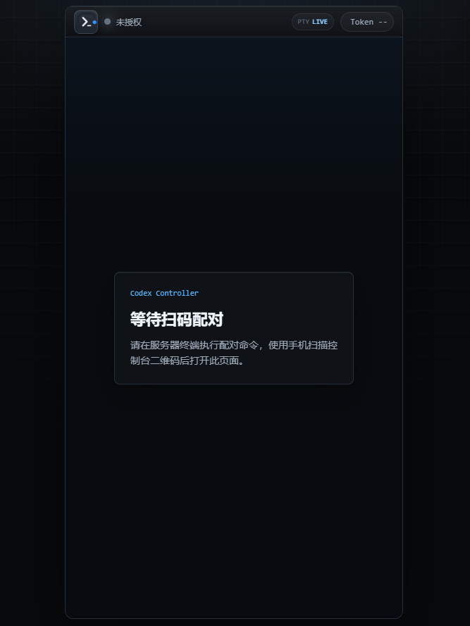
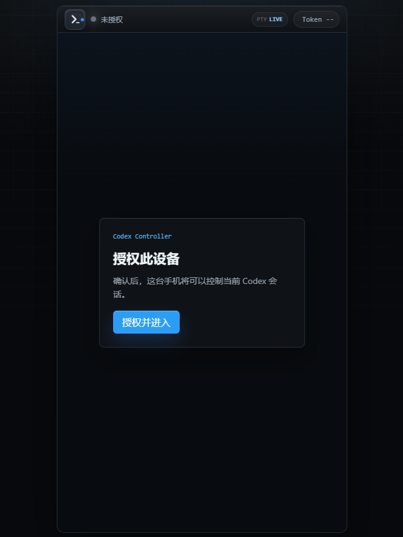
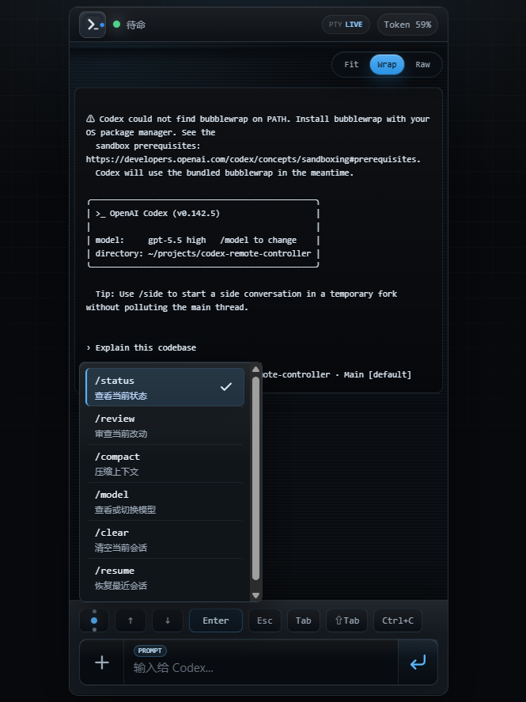
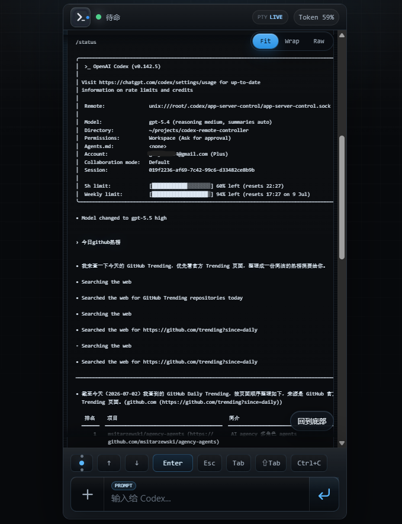

# Codex CLI H5 远程控制器

一个面向手机浏览器的 Codex CLI 远程控制台。服务端在终端生成一次性二维码，手机扫码并确认授权后，才能进入 H5 控制页面，远程操作本机或服务器上的 Codex 会话。

当前版本定位为个人或私有网络使用，不面向多租户公网服务。

## 效果预览

<table>
  <tr>
    <td></td>
    <td></td>
  </tr>
  <tr>
    <td></td>
    <td></td>
  </tr>
</table>

## 功能

- 二维码配对：控制页面必须通过服务端生成的一次性二维码授权进入。
- 设备管理：支持查看已授权设备、撤销设备 Session。
- 真实 Codex 控制：通过 `node-pty` 驱动 Codex CLI，保留 TUI 交互能力。
- 实时输出：通过 WebSocket 推送 Codex 输出、状态和 Token 使用情况。
- 手机端输入：支持普通提问、斜杠命令、快捷命令和 TUI 虚拟按键。
- 终端显示：支持 `Fit`、`Wrap`、`Raw` 三种输出显示模式。
- 控制台 UI：暗色 cockpit 风格，包含仪表状态栏、终端材质输出区、命令 Dock 和低矮虚拟键轨。
- 文件上传：支持文件和图片上传，并转换为 Codex 可引用的本地路径。
- 会话保活：手机短暂断开后可复用原 Codex 会话，避免刷新页面就重启进程。

## 技术结构

```text
apps/server  Fastify API、WebSocket、SQLite、Codex Adapter、CLI 管理命令
apps/web     React + Vite 手机端 H5 控制页面
data         默认 SQLite 数据库和上传文件目录
```

主要链路：

```text
手机浏览器
  -> React H5 控制台
  -> REST 授权/上传/命令
  -> WebSocket 输入/输出
  -> Fastify 服务端
  -> node-pty
  -> Codex CLI
```

## 环境要求

- Node.js 22 或更新版本
- npm workspaces
- 真实 Codex 模式需要当前机器可执行 `codex` 命令

安装依赖：

```bash
npm install
```

## 本地开发

启动服务端：

```bash
npm run dev:server
```

启动 H5 前端：

```bash
npm run dev:web
```

默认地址：

- H5 页面：`http://localhost:5173`
- 服务端：`http://localhost:8787`

开发模式下，Vite 会把 `/api` 和 `/ws` 代理到服务端。

## 使用真实 Codex

默认服务端使用 mock 适配器，方便开发 UI。要连接真实 Codex CLI，推荐修改服务端配置文件：

```bash
cp apps/server/.env.example apps/server/.env
```

然后编辑 `apps/server/.env`：

```dotenv
CODEX_ADAPTER=pty
CODEX_WORKSPACE=/path/to/workspace
CODEX_CLI_ARGS=--no-alt-screen
```

`CODEX_WORKSPACE` 必须是服务器上真实存在的目录，例如你的项目目录。也可以留空，让服务端使用当前启动目录：

```dotenv
CODEX_WORKSPACE=
```

再启动服务端：

```bash
npm run dev:server
```

服务端启动时会自动读取：

1. 项目根目录 `.env`
2. `apps/server/.env`

如果两个文件里有同名配置，`apps/server/.env` 优先。命令行里临时传入的环境变量优先级最高。

也可以不写配置文件，直接临时启动：

```bash
CODEX_ADAPTER=pty \
CODEX_WORKSPACE=/path/to/workspace \
CODEX_CLI_ARGS="--no-alt-screen" \
npm run dev:server
```

常用环境变量：

| 变量 | 默认值 | 说明 |
| --- | --- | --- |
| `PORT` | `8787` | 服务端端口 |
| `HOST` | `0.0.0.0` | 服务端监听地址 |
| `PUBLIC_CONTROLLER_URL` | 从请求推导 | 写入二维码的手机访问地址 |
| `CODEX_ADAPTER` | `mock` | 设置为 `pty` 使用真实 Codex |
| `CODEX_CLI_COMMAND` | `codex` | Codex CLI 命令 |
| `CODEX_CLI_ARGS` | `--no-alt-screen` | Codex CLI 参数 |
| `CODEX_WORKSPACE` | 服务端当前目录 | Codex 工作目录 |
| `CODEX_TOKEN_AUTO_REFRESH` | `true` | 是否自动刷新 Token 展示 |
| `CODEX_TOKEN_REFRESH_MS` | `300000` | Token 自动刷新间隔，默认 5 分钟 |
| `CODEX_TOKEN_PROBE_TIMEOUT_MS` | `20000` | 单次 Token 探测超时时间 |
| `CODEX_SESSION_KEEPALIVE_MS` | `600000` | H5 断开后的会话保留时间 |
| `CONTROLLER_DATA_DIR` | `data` | 运行数据目录 |
| `CONTROLLER_UPLOAD_DIR` | `data/uploads` | 上传目录 |
| `CODEX_ADMIN_TOKEN` | 空 | Admin API 鉴权 Token |

Token 自动刷新不会向当前 Codex 会话输入 `/status`。后端会启动一个独立的短生命周期 Codex 进程做状态探测，只把解析到的百分比推送给 H5，因此不会打断当前对话或 TUI 菜单操作。需要关闭时设置：

```dotenv
CODEX_TOKEN_AUTO_REFRESH=false
```

## 手机扫码配对

生成二维码：

```bash
npm run pair -- http://你的域名或服务器地址:5173
```

手机使用流程：

1. 扫描终端输出的二维码。
2. 打开 `/mobile?token=...`。
3. 点击授权进入。
4. 进入 H5 控制台后即可远程操作 Codex。

二维码 Token 只能使用一次，并且会自动过期。

## 手机端操作

底部输入区包含三层能力：

- 上传入口：选择图片或文件，作为附件传给 Codex。
- 命令输入：普通提问、斜杠命令和附件发送共用一个输入框。
- 虚拟键轨：提供快捷命令入口、`↑`、`↓`、`Enter`、`Esc`、`Tab`、`⇧Tab`、`Ctrl+C`，用于操作 Codex TUI 菜单。

遇到 Codex 让用户选择选项时，推荐使用 `↑` / `↓` 移动，`Enter` 确认。数字快捷键已从默认虚拟键轨移除，减少移动端占位和误触。

输出区的显示模式：

- `Wrap`：默认模式，自动换行，减少横向滑动。
- `Fit`：进一步压缩字号，适合查看宽终端输出。
- `Raw`：保留终端原始布局，适合需要忠实 TUI 画面的场景，长行可能需要横向滑动。

## 设备管理

查看最近 20 个设备：

```bash
npm run devices:list
```

查看全部设备：

```bash
npm run devices:list -- --all
```

撤销设备授权：

```bash
npm run devices:revoke -- <sessionId>
```

撤销后，该设备的 REST 请求会变为未授权，活跃 WebSocket 也会被关闭或失效。

## 简单部署

适合个人服务器或局域网机器。

1. 安装依赖：

```bash
npm install
```

2. 构建前端和服务端：

```bash
npm run build:web
npm run build:server
```

3. 启动服务端并托管构建后的 H5：

```bash
CODEX_ADAPTER=pty \
CODEX_WORKSPACE=/path/to/workspace \
node apps/server/dist/main.js
```

构建后服务端会默认托管 `apps/web/dist`。如果你需要改成其他静态目录，再设置 `WEB_DIST_DIR`。

4. 生成手机配对二维码：

```bash
npm run pair -- http://你的域名或服务器地址:8787
```

如果扫码打开 `/mobile?token=...` 出现 404，通常说明服务端没有找到构建后的 H5。请确认已经执行过 `npm run build:web`，并且启动的是构建后的服务端。开发模式下如果只启动了 `npm run dev:server`，请同时启动 `npm run dev:web`，并用前端地址生成二维码：

```bash
npm run pair -- http://你的域名或服务器地址:5173
```

生产环境建议：

- 使用反向代理提供 HTTPS。
- 不要把 Admin API 暴露给不可信网络。
- 对公网访问设置 `CODEX_ADMIN_TOKEN`。
- 将 `data` 目录放在可持久化且权限受控的位置。
- 根据实际风险配置 Codex sandbox 和工作目录权限。

## 常用命令

```bash
npm run dev:web
npm run dev:server
npm run build:web
npm run build:server
npm run check:web
npm run check:server
npm --workspace apps/web run verify:responsive -- http://localhost:5173/
```

## 当前限制

- 主要面向单用户私有控制器，不是多人协作平台。
- 设备管理目前通过 CLI 或 Admin API 完成，还没有浏览器管理后台。
- H5 Session Token 存储在 `localStorage`。
- 输出历史以终端快照为主，不保存完整转录。
- Codex TUI 输出格式变化时，Token 解析和行级渲染可能需要同步调整。
- 真实 Codex 模式依赖本机 Codex CLI、登录态、工作目录和权限配置。

## 规划待办

- 增加浏览器版设备管理后台。
- 增加会话选择与会话恢复列表。
- 增加更完整的操作审计和命令历史。
- 优化移动端长输出性能和搜索能力。
- 增加上传文件预览、删除和过期清理策略。
- 增加更清晰的生产部署示例，包括 HTTPS 反向代理。
- 补充端到端自动化测试，覆盖扫码授权、上传和真实 TUI 操作。

## 开发记录

详细阶段性记录见 `DEVELOPMENT_PROGRESS.md`。
